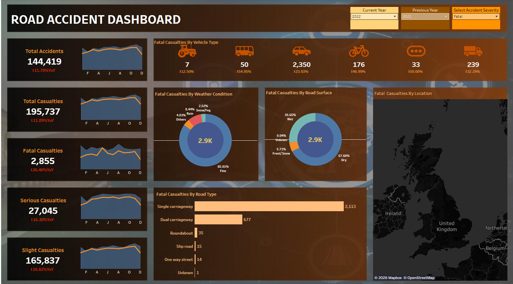

# Data Analytics Specialist

**Technical Skills:** Power BI, SQL, R, Python, SAS, MATLAB

Data Analyst specializing in **Data Visualization, Report Automation, and scalable data analysis workflows** using Power BI, R, Python, and SQL.

---

# Education

**University of Alberta — Edmonton Alberta**  
Bachelor of Arts, Economics

- Relevant Coursework: Data Analysis with SAS, Python and R, Economic Forecasting, Applied Statistics, A/B Testing, Calculus II  
- First Class Academic Standing (GPA >3.5)

---

# Experience

### Junior Economist @ Government of Alberta (May 2024 – Present)

- Built and deployed an enterprise-scale Labour Market Insights dashboard in Power BI, modeling a 45M-row dataset to produce executive ready insights.  
- Led advanced R & SQL-based analysis on the impact of migration on Alberta’s labour market and fully automated monthly data pipeline.

---

### Junior Economist @ Government of Canada (Jan 2024 – May 2024)

- Built Power BI dashboard offering real-time web-scraped emissions source mapping.  
- Spearheaded one of seven segments on Prairie economy analysis for the CIIT binder to the Prime Minister.

---

# Analytics Projects

---

# Labour Market Analysis

## Hiring Demand Bulletin  
**Excel • Report Writing • Data Analytics**

[View Report](https://github.com/efeoroh/efeoroh.github.io/blob/main/Hiring%20Demand%20Bulletin_March%202025.pdf)

Developed a labour market hiring demand bulletin analyzing job posting trends and labour demand indicators.

---

# Music Analytics

## Spotify Streaming Analytics Dashboard  
**Power BI • Data Visualization • Analytics**

[View Dashboard](https://github.com/efeoroh/efeoroh.github.io)

Interactive Power BI dashboard analyzing Spotify streaming data including track performance, artist metrics, and release trends.

---

# Automation

## Industry Reports Automation  
**R • Automation • Data Analysis**

Automated report building for **18 industries**, processing **2M+ rows of data** and generating reports simultaneously using R.

---

# Energy

*(Future Energy Analytics Projects)*

Energy market analytics, pipeline throughput analysis, electricity generation modeling, and emissions analytics projects will be added here.

---

# Other Analytics Projects

## Impact of Covid on Edmonton Real Estate  
**R • Data Visualization • Analytics • Machine Learning**

[View Report](https://github.com/efeoroh/efeoroh.github.io/blob/main/Competition%20Submission_Impact%20of%20Covid19%20RealEstate.pdf)

Published a paper analyzing how Covid-19 reshaped housing patterns in Edmonton AB.

---

# Skills

**Software Tools:** Python, R, SQL, SAS, Tableau, Power BI, DAX, Statistics, Excel, Time Series, Databricks, Predictive Analytics, Prescriptive Analytics, A/B Testing, Data Analytics, Prompt Engineering, Jupyter Notebook
