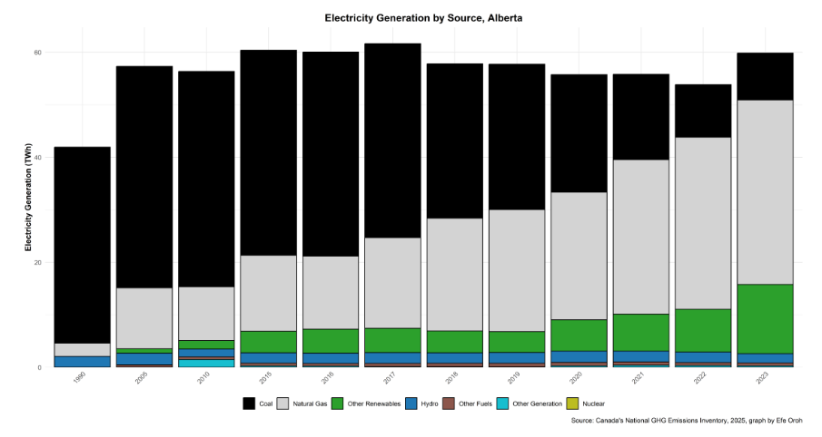
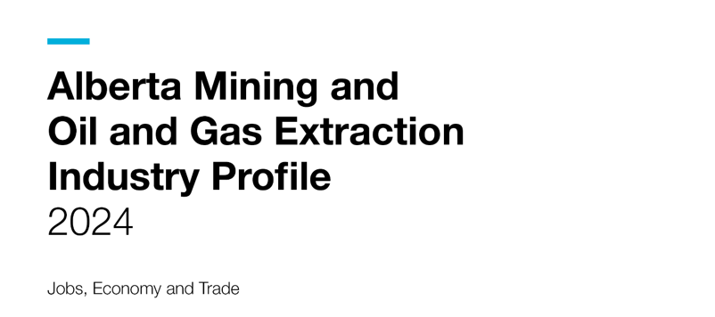
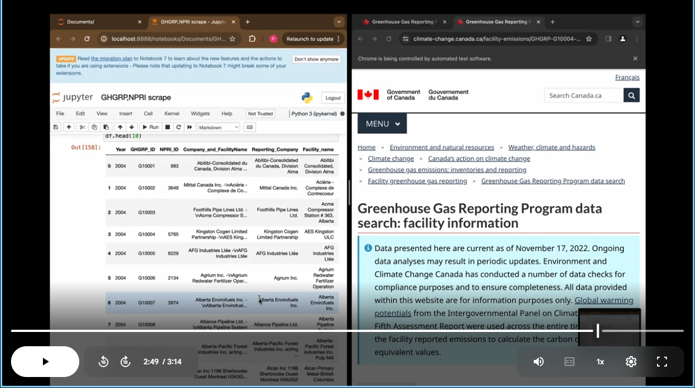
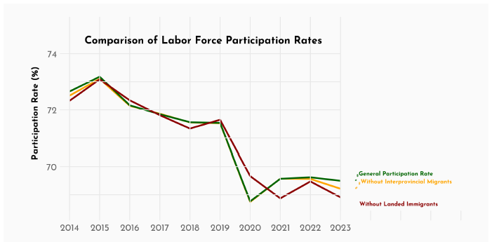

<h1>Data Analytics Specialist</h1>

<b>Technical Skills:</b> Power BI, SQL, R, Python, SAS, MATLAB

Data Analyst specializing in Data Visualization, Report Automation, and scalable data analysis workflows
using Power BI, R, Python, and SQL.

Education

<b>University of Alberta — Edmonton Alberta</b> 
Bachelor of Arts, Economics

<ul>
<li>Relevant Coursework: Data Analysis with SAS, Python and R, Economic Forecasting, Applied Statistics, A/B Testing, Calculus II</li>
<li>First Class Academic Standing (GPA &gt; 3.5)</li>
</ul>

Experience

Junior Economist @ Government of Alberta (May 2024 – Present)

<ul>
<li>Built and deployed an enterprise-scale Labour Market Insights dashboard in Power BI modeling a 45M-row dataset.</li>
<li>Led advanced R & SQL analysis on migration impacts on Alberta’s labour market and <b>automated the monthly reporting pipeline.</li>
</ul>

Junior Economist @ Government of Canada (Jan 2024 – May 2024)

<ul>
<li>Built a Power BI dashboard with real-time web-scraped emissions mapping.</li>
<li>Spearheaded one of seven analytical segments in a Prairie economy report prepared for the Prime Minister's CIIT binder.</li>
</ul>

Data Science Intern @ Deloitte Consulting (May 2022 – Aug 2022)

<ul>
<li>Performed <b>customer churn analysis</b> for a $12.41B telecommunications company.</li>
<li>Developed a <b>machine learning churn prediction model</b> exceeding identification targets by 10%.</li>
</ul>

Analytics Projects

Energy

<a href="CanadianCrudePrice_TradeVulnerability.html">
Canadian Crude Price Outlook + Impact of Tariffs on Crude Oil Analysis
</a>

R • Energy Market Analytics • Data Visualization

Analysis of Canada’s crude oil trade vulnerability examining tariffs,
market access constraints, and reliance on U.S. imports.

<a href="Shipment_Pipeline_Royalty_Analysis.html">
Canadian Energy Infrastructure Analysis: Shipments, Pipelines, and Royalty Revenues
</a>

R • Energy Infrastructure Analytics • Data Visualization

Analysis of Canada’s oil transportation infrastructure examining pipeline capacity,
export routes, and production flows influencing Alberta royalty revenues.

<a href="Canada_Electricity_Generation_Emissions_Analysis.html">
Canada Electricity Generation and Emissions Analysis
</a>

R • Energy Systems Analytics • Data Visualization

Analysis of Canada’s electricity generation mix and emissions trends across provinces.

 

Music Analytics

<a href="images/Spotify Dashboard.png">
Spotify Streaming Analytics Dashboard
</a>

Power BI • Data Visualization • Analytics

Interactive Power BI dashboard analyzing Spotify streaming performance and listening trends.

 

Automation

<a href="jet-alberta-mining-and-oil-and-gas-extraction-industry-profile.pdf">
Industry Reports Automation
</a>

R • Automation • Data Analysis

Automated report generation for <b>18 industries</b> processing <b>2M+ rows of data</b>
and generating multiple industry reports simultaneously.

<a href="Webscraping research project (2) (1).mp4">
Greenhouse Gas Data Pull Automation
</a>

Python • Web Scraping • Automation

Automated the extraction and cleaning of <b>1M+ rows of greenhouse gas emissions data</b> used in a GHG analytics dashboard. The workflow fully automated the data refresh pipeline for a dashboard requiring <b>annual updates</b>, eliminating manual data collection and ensuring reproducible updates each reporting cycle.

Indigenous Statistics Data Pipeline Automation

R • Automation • Data Engineering

Automated the extraction and processing of <b>5M+ rows of Indigenous statistical data</b> used in multiple recurring analytical reports. The pipeline standardized data ingestion, cleaning, and transformation for repeated reporting workflows. Project outputs cannot be displayed publicly due to data access restrictions.

 

Labour Market Analysis

<a href="Impact_of_Migration_on_Alberta_s_Participation_Rate.pdf">
Investigating the Impact of Migration on Alberta’s Labour Force
</a>

R • Economic Modeling • Data Visualization • Labour Market Analytics

Large-scale labour market analysis using <b>2M+ rows of labour force data</b> and a range of industry-standard statistical methods and visualizations.

The project implemented <b>economic modeling of four counterfactual scenarios</b> to isolate the effect of migration on Alberta’s labour force participation rate:

<ul>
<li>Alberta without interprovincial migration</li>
<li>Alberta without international migration</li>
<li>Alberta without both</li>
<li>Observed labour force outcomes</li>
</ul>

<a href="Hiring Demand Bulletin_March 2025.pdf">
Hiring Demand Bulletin
</a>

Excel • Report Writing • Data Analytics

Recurring labour market bulletin analyzing hiring demand across <b>18 industries</b>, organized into major economic sectors including <b>Technology, Health, Mining and Oil & Gas Extraction, and Education</b>, and further disaggregated by Alberta’s <b>central economic regions</b>.

 

Other Analytics Projects

<a href="Competition_Submission_Impact_of_Covid19_RealEstate.pdf">
Impact of Covid on Edmonton Real Estate
</a>

R • Data Visualization • Analytics • Machine Learning

<b>1st Place Winner and Cash Prize.</b> Competition involving Masters+ and some Bachelors students tasked with analyzing City of Edmonton datasets to examine the impact of Covid-19 on Edmonton’s housing market. I led <b>Section 5 — the core descriptive analysis</b>, conducting large-scale exploratory analysis that identified the key structural changes in housing demand and price dynamics, which subsequently informed the predictive models built by the team.

Skills

<b>Software Tools:</b> Python, R, SQL, SAS, Tableau, Power BI, DAX, Statistics,
Excel, Time Series, Databricks, Predictive Analytics, Prescriptive Analytics,
A/B Testing, Data Analytics, Prompt Engineering, Jupyter Notebook

