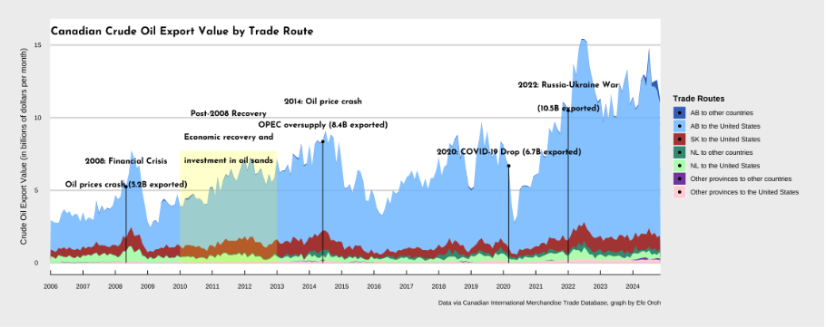
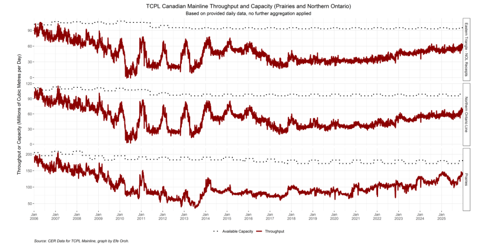
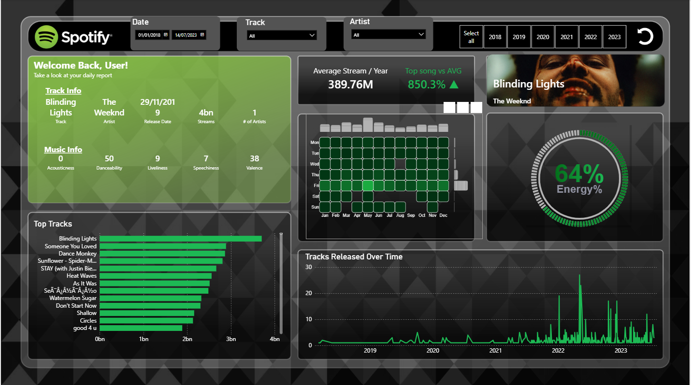
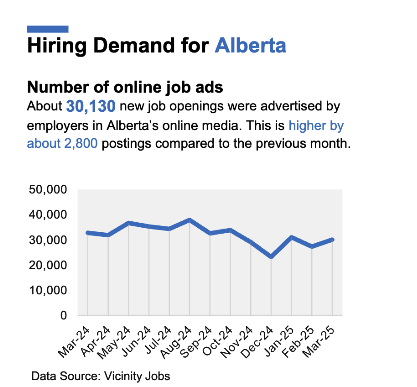
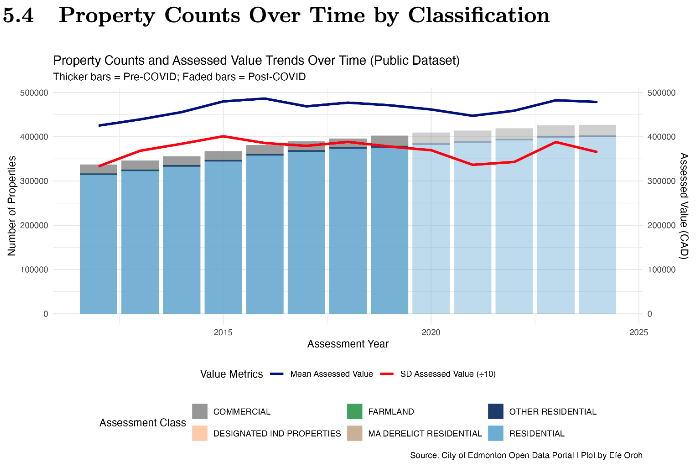

# Data Analytics Specialist

**Technical Skills:** Power BI, SQL, R, Python, SAS, MATLAB

Data Analyst specializing in **Data Visualization, Report Automation, and scalable data analysis workflows** using Power BI, R, Python, and SQL.

---

# Education

**University of Alberta — Edmonton Alberta**  
Bachelor of Arts, Economics

- Relevant Coursework: Data Analysis with SAS, Python and R, Economic Forecasting, Applied Statistics, A/B Testing, Calculus II  
- First Class Academic Standing (GPA >3.5)

---

# Experience

### Junior Economist @ Government of Alberta (May 2024 – Present)

- Built and deployed an enterprise-scale Labour Market Insights dashboard in Power BI, modeling a **45M-row dataset** to produce executive-ready insights.  
- Led advanced R & SQL analysis on migration impacts on Alberta’s labour market, and **fully automated the monthly reporting pipeline.**

---

### Junior Economist @ Government of Canada (Jan 2024 – May 2024)

- Built a **Power BI dashboard with real-time web-scraped emissions mapping**, providing multi-year analytical value to the team.  
- Spearheaded one of seven analytical segments in a **Prairie economy report prepared for the Prime Minister's CIIT binder**.

---

### Enterprise Sales Intern @ Microsoft (May 2023 – Aug 2023)

- Demonstrated analytical skills by analyzing **Nigeria’s top four banks**, creating market trend visualisations, and delivering an endorsed cybersecurity presentation at a major tech gathering.  
- Organized a high-impact technology event with 400+ attendees, focused on AI bias challenges and ethical awareness in emerging technologies.

---

### Data Science Intern @ Deloitte Consulting (May 2022 – Aug 2022)

- Performed **customer churn analysis for a $12.41B telecommunications company**, automating data cleaning and visualization for **400k+ rows**, reducing manual reporting time by **94%**.  
- Developed a **machine learning churn prediction model**, exceeding churn risk identification targets by **10%**.

---

# Analytics Projects

---

# Energy

## Canadian Crude Price Outlook + Impact of Tariffs on Crude Oil Analysis  
**R • Energy Market Analytics • Data Visualization**

Analysis of **Canada’s crude oil trade vulnerability**, examining how tariffs, market access constraints, and reliance on U.S. imports influence Canadian crude pricing dynamics under different global energy scenarios.

---

## Canadian Energy Infrastructure Analysis: Shipments, Pipelines, and Royalty Revenues  
**R • Energy Infrastructure Analytics • Data Visualization**

Analysis of **Canada’s oil transportation infrastructure and fiscal outcomes**, examining how pipeline capacity, export routes, and production flows influence Alberta’s royalty revenues and Canada’s energy export dynamics.

---

# Music Analytics

## Spotify Streaming Analytics Dashboard  
**Power BI • Data Visualization • Analytics**

)

Interactive Power BI dashboard analyzing **Spotify streaming performance**, enabling exploration of track popularity, artist metrics, and release trends across time.

---

# Automation

## Industry Reports Automation  
**R • Automation • Data Analysis**

**Automated report building for 18 industries**, processing **2M+ rows of data** and generating multiple industry reports simultaneously using R-based data pipelines and automated reporting workflows.

---

# Labour Market Analysis

## Hiring Demand Bulletin  
**Excel • Report Writing • Data Analytics**

Developed a **labour market hiring demand bulletin**, analyzing job posting trends and labour demand indicators to identify shifts in hiring activity across industries.

---

# Other Analytics Projects

## Impact of Covid on Edmonton Real Estate  
**R • Data Visualization • Analytics • Machine Learning**

Published a paper analyzing **how Covid-19 reshaped housing patterns in Edmonton**, using statistical analysis and data visualization to identify structural changes in housing demand.

---

# Skills

**Software Tools:** Python, R, SQL, SAS, Tableau, Power BI, DAX, Statistics, Excel, Time Series, Databricks, Predictive Analytics, Prescriptive Analytics, A/B Testing, Data Analytics, Prompt Engineering, Jupyter Notebook
